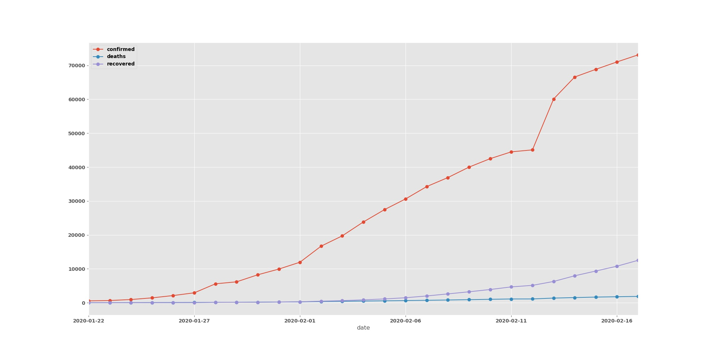
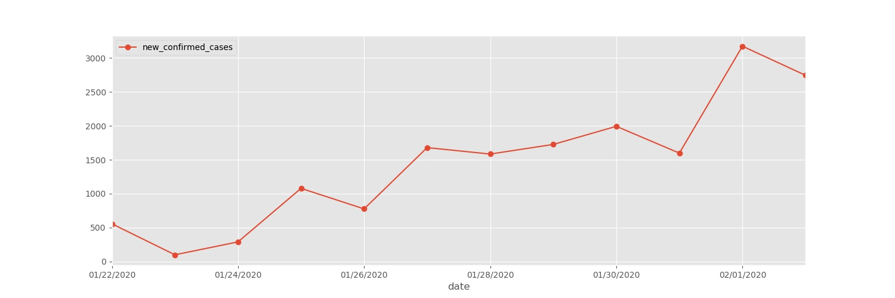
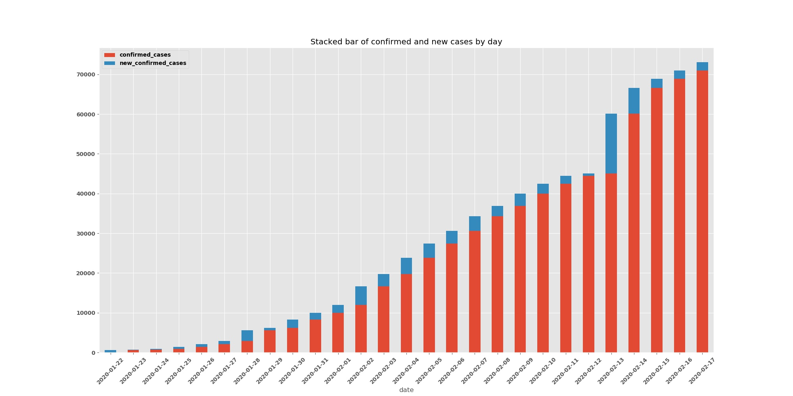
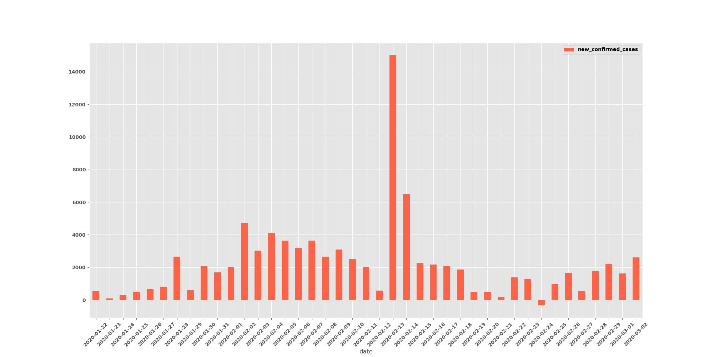
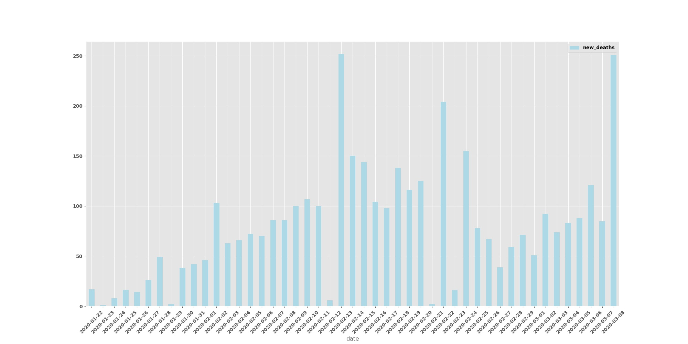
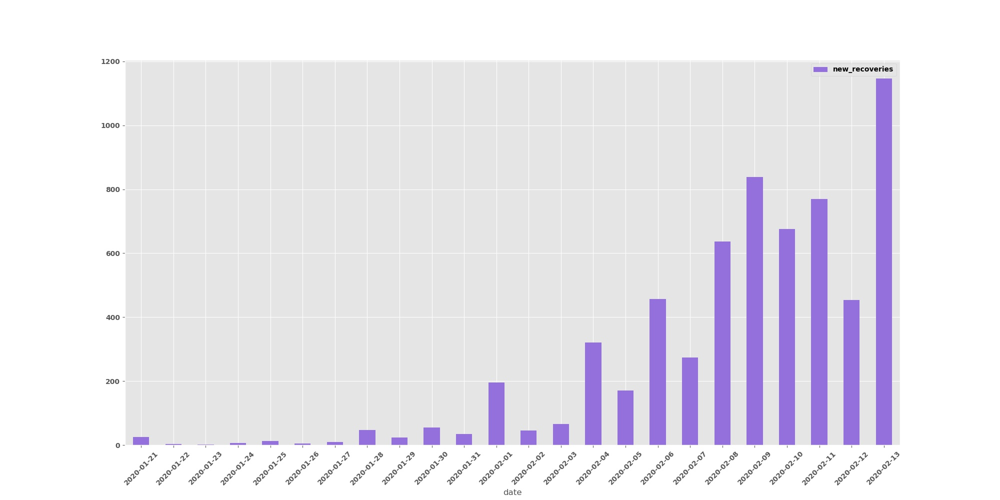
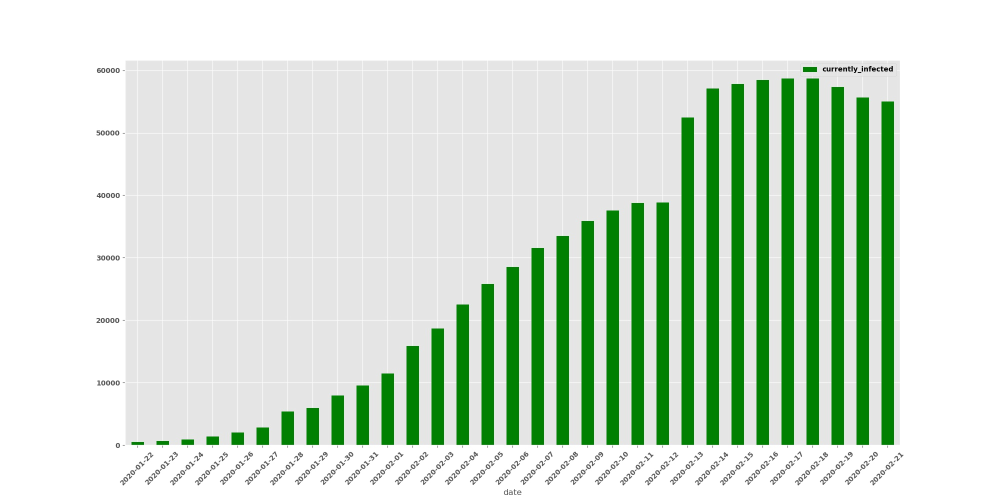

# covid-19-analysis
[](https://pypi.python.org/pypi/covidify/) [](https://opensource.org/licenses/mit-license.php) [](https://pypi.python.org/pypi/covidify/)  [](https://github.com/AaronWard/covid-19-analysis/issues) []()


This repo is for analysis on the [corona virus / covid-19](https://www.who.int/health-topics/coronavirus) that will extract the latest data and generate reports. This repo will be **updated daily**


#### To-do list
- checkout the [kanban boards](https://github.com/AaronWard/covid-19-analysis/projects) to see work in progress


<hr>


### Installation

- ```pip install covidify```


**How to run:**

```powershell
Desktop $covidify
Usage: covidify [OPTIONS] COMMAND [ARGS]...

  ☣  COVIDIFY ☣

   - use the most up-to-date data to generate reports of confirmed cases,
   fatalities and recoveries.

Options:
  --help  Show this message and exit.

Commands:
  run
```

```powershell
$ covidify run --help
Usage: covidify run [OPTIONS]

Options:
  --output TEXT  Folder to output data and reports [Default:
                 /Users/$USER/Desktop/covidify-output/]
  --source TEXT  There are two datasources to choose from, John Hopkins github
                 repo or wikipedia -- options are git or wiki respectively
                 [Default: git]
  --help         Show this message and exit.
```

**Example Commands:**
```powershell
# Will default to desktop folder 
# for output and github for datasource
covidify run 
```

```powershell
# Will default to desktop folder for output
covidify run --source=wiki   
```

```powershell
covidify run --output=/Users/award40/Documents/projects-folder --source=git
```

**Results:**
- The package will pull the latest live data and generate following in the output folder:
    - Preprocessed time series data
    - graph reports


<hr>

### Visualization of data
This plots will be updated daily to visualize stats 3 attributes: 
- ```confirmed cases```
- ```deaths```
- ```recoveries```


##### Trend Line

This is an accumalitive sum trendline for all the confirmed cases, deaths and recoveries.


##### Daily Trend Line

This is an daily sum trendline for all the confirmed cases, deaths and recoveries.


##### Stacked Daily Confirmed Cases

This stacked bar chart shows a daily sum of people who are currently confirmed (<i>red</i>) and the number of people who have been been confirmed on that day (<i>blue</i>)




##### Daily Confirmed Cases

A count for new cases recorded on that given date, does not take past confirmations into account. 


##### Daily Deaths

A count for deaths due to the virus recorded on that given date, does not take past deaths into account. 


##### Daily Recoveries

A count for new recovories recorded on that given date, does not take past recoveries into account. 


##### Currently Infected

A count for all the people who are currently infected for a given date (confirmed cases - (recoveries + deaths))



<hr>

### Data Source
- The data comes from the **Novel Coronavirus (COVID-19) Cases**, which is a live dataset provided by JHU CSSE. 
- Data available [here](https://github.com/CSSEGISandData/2019-nCoV).


### Appendix
- All code written by me (Aaron Ward  - https://www.linkedin.com/in/aaronjward/)
- A special thank you to the [JHU CSSE](https://systems.jhu.edu/) team for maintaining the data
