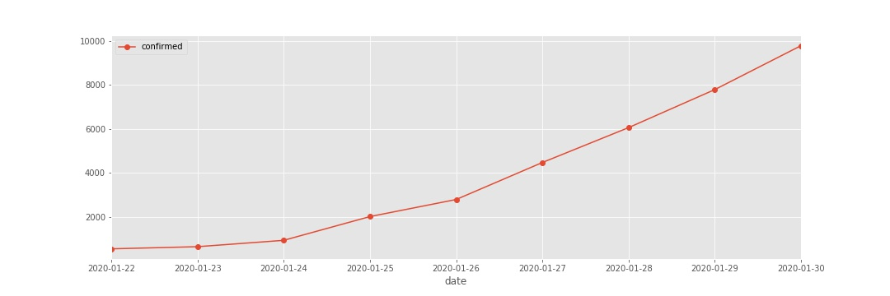
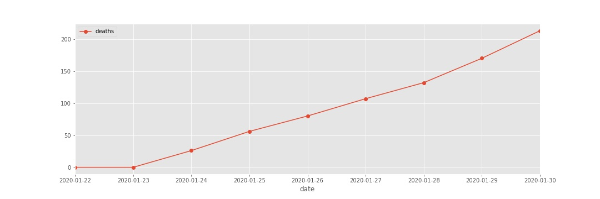
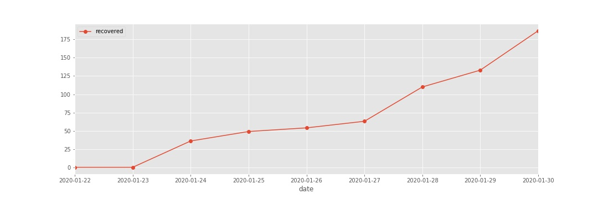
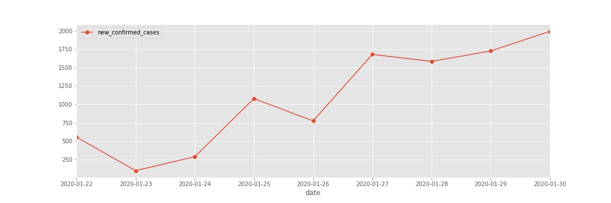
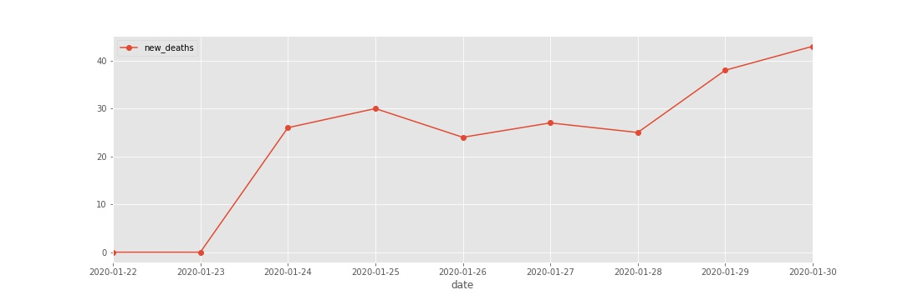
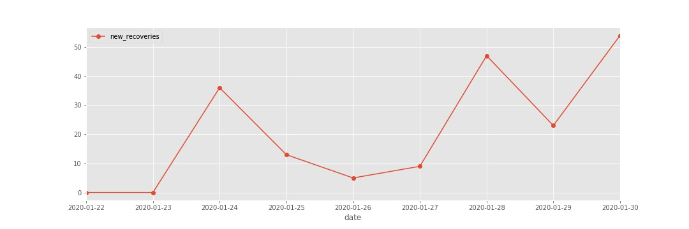

# coronavirus-analysis

This repo for analysis on the [corona virus](https://www.who.int/health-topics/coronavirus). This includes:  

**To Do:**
- [X] Script for extracting google sheet data and preprocessing it into a time series dataset
- [X] Do data exploration using tableau
- [ ] Do data exploration using pandas
- [ ] Implement time series analysis and apply machine learning to predict the potential confirmed cases in the future. (<i>waiting on more data for the days to come</i>)

### Data
- The data come from the **Novel Coronavirus (2019-nCoV) Cases**,  which is a live dataset provided by JHU CSSE. 
- Data available [here](https://docs.google.com/spreadsheets/d/1yZv9w9zRKwrGTaR-YzmAqMefw4wMlaXocejdxZaTs6w).
- In `data_prep.py` the data extracts the latest entry for each date, and aggregates all the records into a time series dataset.
- The script is reproducible, but you will need to enable Google API Access to run it yourself. Follow [this](https://developers.google.com/sheets/api/quickstart/python) tutorial.

### Code
- `data_prep.py` will save 3 files, 2 for the aggregated time series data (in csv and parquet format) and one for the summed confirms, deaths and recoveries by day for trendlining. 
- When the script is run, the files will be saved to a datafolder titled with the current date of extraction.

##### News Sources and Materials
- [Live Tracker Map](https://gisanddata.maps.arcgis.com/apps/opsdashboard/index.html#/bda7594740fd40299423467b48e9ecf6)
- [How To Stay Safe](https://www.who.int/emergencies/diseases/novel-coronavirus-2019/advice-for-public)
- [Latest Google News Feed](https://www.google.com/search?q=coronavirus&tbm=nws&sxsrf=ACYBGNTsjxRI2IRU0X88bcksb5doQCKzDA:1580388795464&source=lnt&tbs=qdr:d&sa=X&ved=0ahUKEwjiwYqGr6vnAhWYUt4KHQZQB-QQpwUIIA&biw=2133&bih=1052&dpr=0.9)

## Visualization of data
This plots will be updated <u>daily</u> to visualize the trend in aggregated sums and the daily counts for 3 attributes: **<i>Confirmed Cases, Deaths and Recoveries.</i>**

**Confirmed Cases**
this is an aggregated sum trendline for all the cases that have been confirmed with the corona virus

**Deaths**
this is an aggregated sum trendline for all people who have died.

**Recoveries**
An aggregated sum trendline for all the cases were confirmed and later the person has recovered

**Daily Confirmed Cases**
A count for new cases recorded on that given date, does not take past confirmations into account. 

**Daily Deaths**
A count for deaths due to coronavirus recorded on that given date, does not take past deaths into account. 

**Daily Recoveries**
A count for new recovories recorded on that given date, does not take past confirmations into account. 

