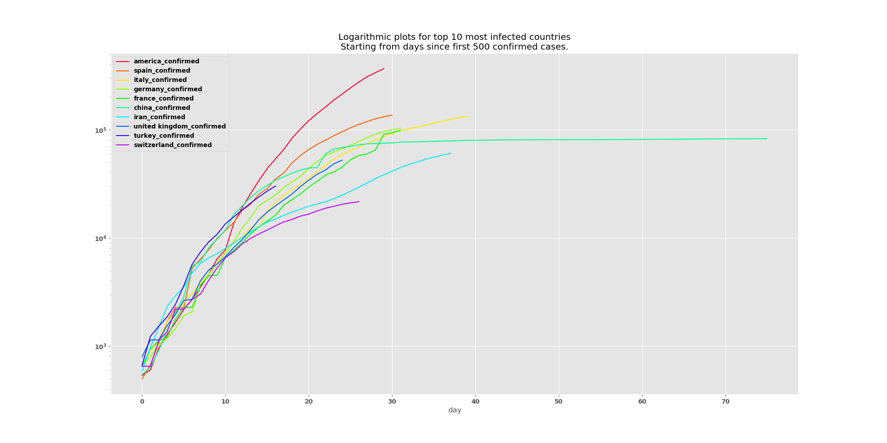
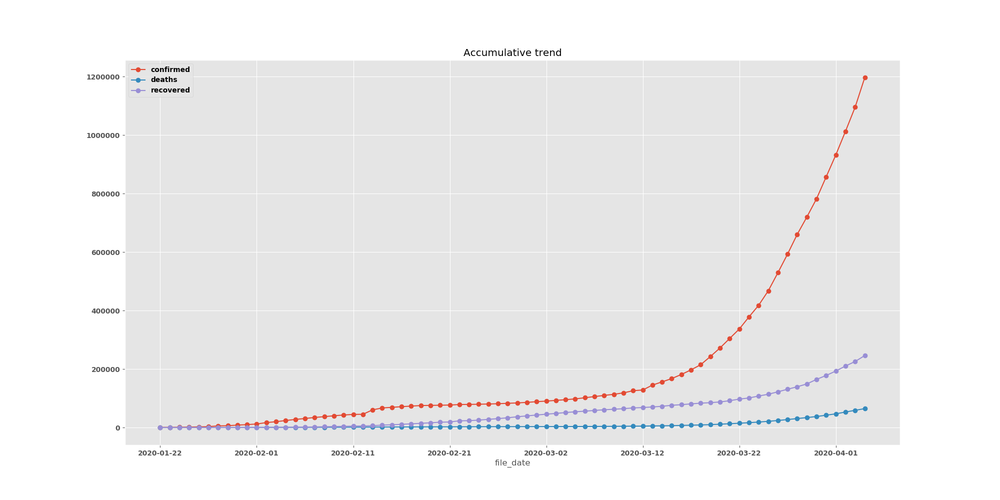
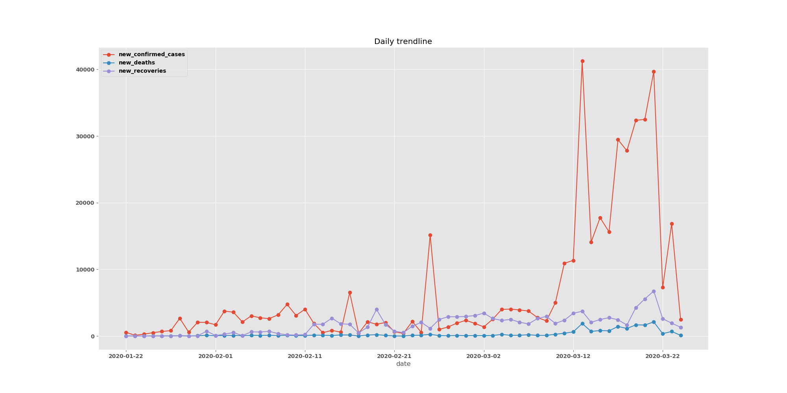
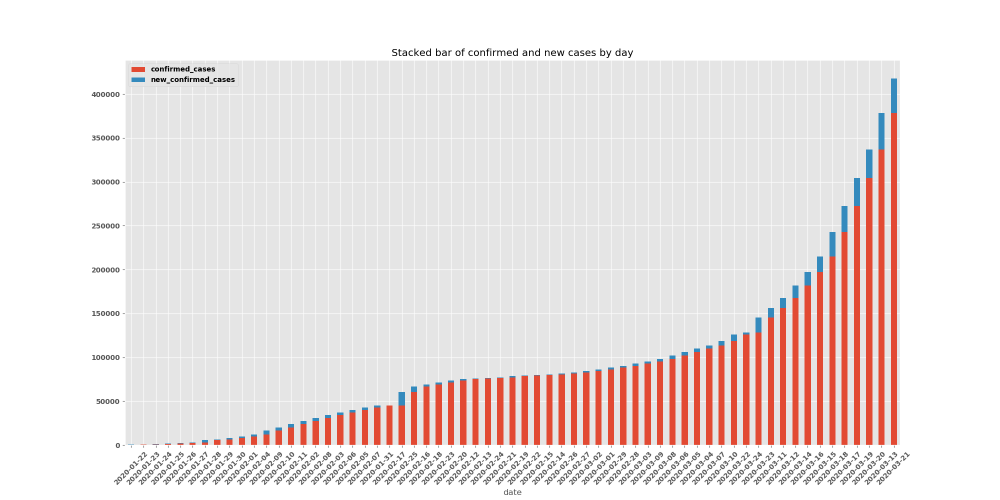
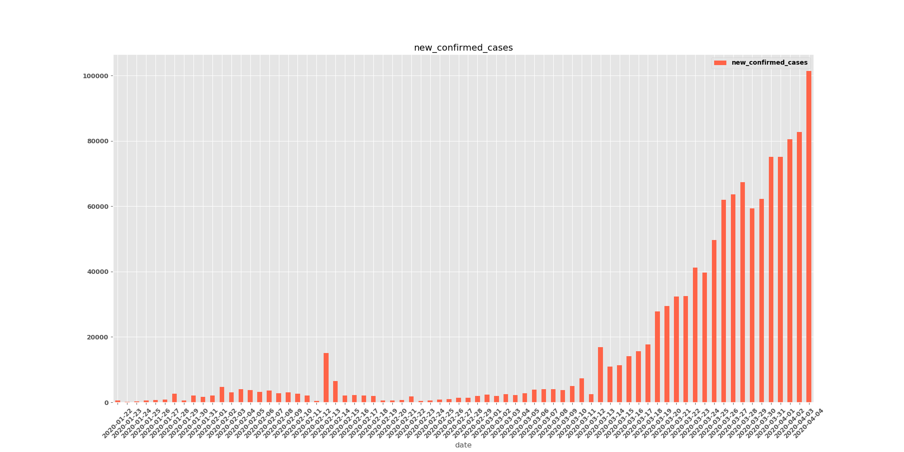
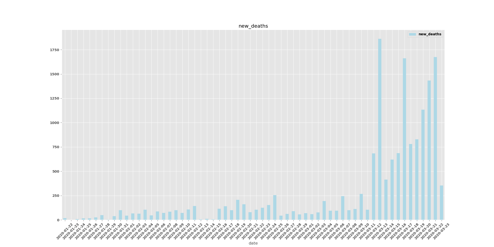
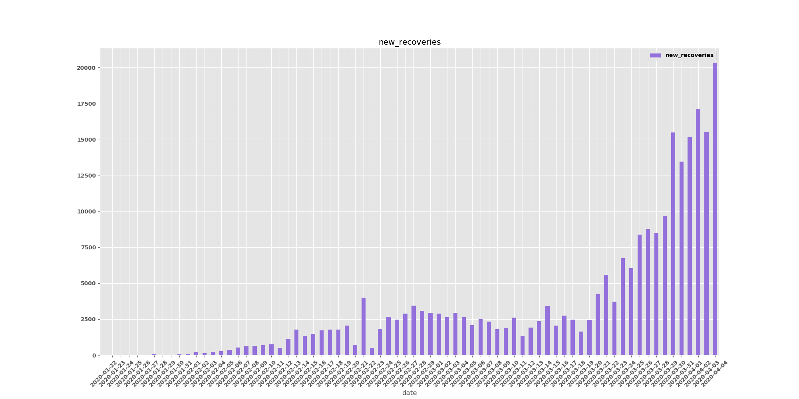
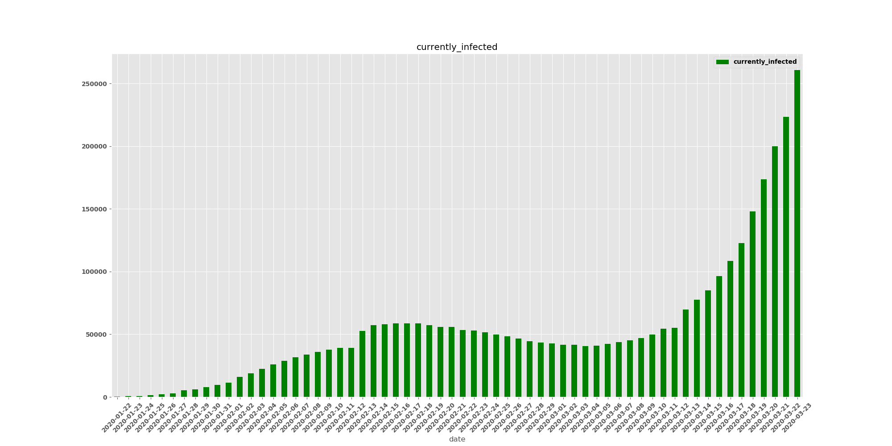

# covidify  [](https://pypi.python.org/pypi/covidify/)   [](https://pypi.python.org/pypi/covidify/)


<p align="center">
  <a href="#features">Features</a> •
  <a href="#how-to-use">How To Use</a> •
  <a href="#install">Install</a> •
  <a href="#visualizations">Visualizations</a> •
  <a href="https://github.com/CSSEGISandData/COVID-19">Data Source</a> •
  <a href="#credits">Credits</a> •
  <a href="https://github.com/AaronWard/covidify/projects">To-Do List</a> 
</p>
<hr>


## Features
Covidify downloads the latest [covid-19](https://www.who.int/health-topics/coronavirus) data for confirmed cases, deaths and recoveries. 
- Creates a time series dataset
- Creates a daily stats dataset 
- Generate visualizations
- Filter by country
- List all countries affected
- Shows number of people currently infected
- Generates an excel report including all of the above 


<hr>


## Install

- ```pip install covidify```

## How to use

```powershell
$ covidify
Usage: covidify [OPTIONS] COMMAND [ARGS]...

  ☣  COVIDIFY ☣

   - use the most up-to-date data to generate reports of 
     confirmed cases, fatalities and recoveries.

Options:
  --help  Show this message and exit.

Commands:
  list  List all the countries that have confirmed cases.
  run   Generate reports for global cases or refine by country.
```

```powershell
$ covidify run --help
Usage: covidify run [OPTIONS]

Options:
  --output TEXT   Folder to output data and reports [Default:
                  /Users/award40/Desktop/covidify-output/]
  --source TEXT   There are two datasources to choose from, John Hopkins
                  github repo or wikipedia -- options are JHU or wiki
                  respectively [Default: JHU]
  --country TEXT  Filter reports by a country
  --top TEXT      Top N infected countries for log plot. [Default: 10]
  --help          Show this message and exit.
```


**Example Commands:**

```powershell
# List all countries affected 
covidify list --countries
```

```powershell
# Will default to desktop folder for output and github for datasource
covidify run 
```


```powershell
# Specify output folder and source
covidify run --output=<PATH TO DESIRED OUTPUT FOLDER>
```

```powershell
# Filter reports by country
covidify run --country="South Korea"
```

```powershell
# Show top 20 infected countries on a logarithmic scale
covidify run --top=20
```

<hr>

## Visualizations
An excel spreadsheet is generated with a number of visualizations and statistics.


##### Logarithmic Plot

This plot shows the top `N` infected countries on a logarithmic scale.



##### Accumalitive Trend

This is an accumulative sum trendline for all the confirmed cases, deaths and recoveries.


##### Daily Trendline

This is a daily sum trendline for all the confirmed cases, deaths and recoveries.


##### Stacked Daily Confirmed Cases

This stacked bar chart shows a daily sum of people who are alread confirmed (<i>red</i>) and the people who have been been confirmed on that date (<i>blue</i>)




##### Daily Confirmed Cases

A count for new cases on a given date, does not take past confirmations into account. 


##### Daily Deaths

A count for deaths on a given date, does not take past deaths into account. 


##### Daily Recoveries

A count for new recoveries on a given date, does not take past recoveries into account. 


##### Currently Infected

A count for all the people who are currently infected for a given date.



<hr>

## Credits
- Written by me (Aaron Ward  - https://www.linkedin.com/in/aaronjward/)
- A special thank you to the [JHU CSSE](https://systems.jhu.edu/) team for maintaining the data
- Also a special thank you to @ajaymaity for bug fixes 🎉