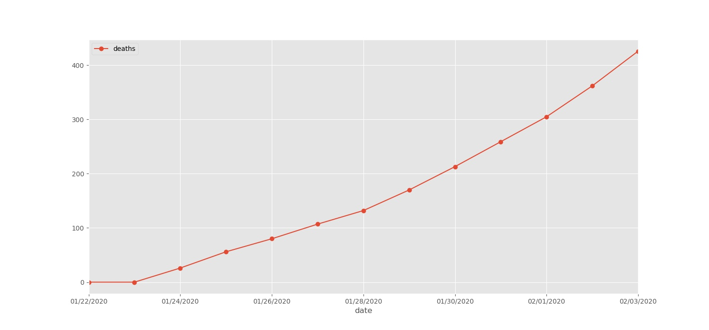
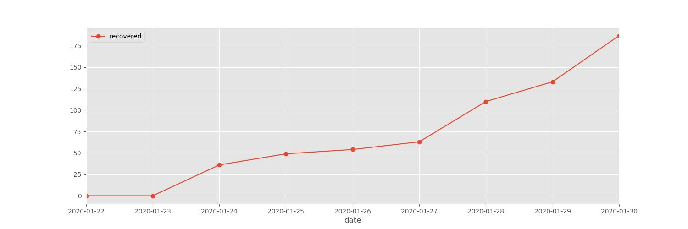

# coronavirus-analysis

This repo is for analysis on the [corona virus](https://www.who.int/health-topics/coronavirus) that will extract the latest data and generate reporting visualizations and information sheets.

### Data:
- The data come from the **Novel Coronavirus (2019-nCoV) Cases**,  which is a live dataset provided by JHU CSSE. 
- Data available [here](https://docs.google.com/spreadsheets/d/1wQVypefm946ch4XDp37uZ-wartW4V7ILdg-qYiDXUHM).

### How to run:
- `git clone corona-analysis` and `cd` into repository
- run `pip install -r requirements.txt` to install dependencies
- run `./pipeline.sh`
- You may need to authenticate using OAuth, a browser screen will pop up, just click allow. Follow [this](https://developers.google.com/sheets/api/quickstart/python) tutorial. 
- Make sure you add your own `credentials.json` file to the src folder.
- Results will be saved to `reports` folder. 

**TODO:**

- checkout the [kanban boards](https://github.com/AaronWard/coronavirus-analysis/projects) to see future work on this project

## Visualization of data:

This plots will be updated <u>daily</u> to visualize the trend in accumalitive sums and the daily counts for 3 attributes: 
- **<i>Confirmed Cases</i>**
- **<i>Deaths</i>**
- **<i>Recoveries.</i>**

Last updated:  `2020-02-08`

**Confirmed Cases**

This is an aggregated sum trendline for all the confirmed cases with the corona virus

**Daily Confirmed Cases**

A count for new cases recorded on that given date, does not take past confirmations into account. 

**Deaths**

This is an aggregated sum trendline for all people who have died.

**Daily Deaths**

A count for deaths due to coronavirus recorded on that given date, does not take past deaths into account. 

**Recoveries**

An aggregated sum trendline for all the cases were confirmed and later the person has recovered

**Daily Recoveries**

A count for new recovories recorded on that given date, does not take past recoveries into account. 

**Currently Infected Count**

Because of the data only recorfs for number of confirmed cases, it doesnt show how many for a given day actually have the virus. This shows number of daily confirmed numbers minus the people who have died/recovered.  

## Additional information and thanks
- All code written by me (Aaron Ward  - https://www.linkedin.com/in/aaronjward/)
- A special thank you to the [JHU CSSE](https://systems.jhu.edu/) team for maintaining the data